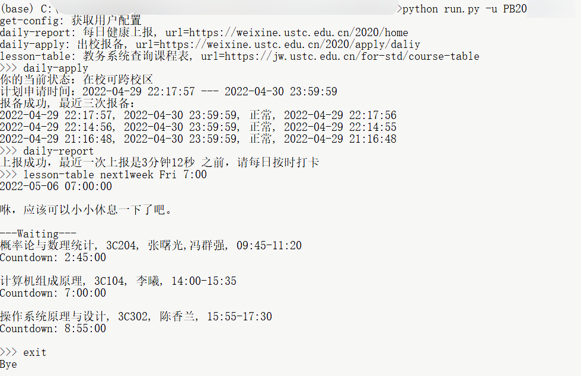

# USTC 助手

[English](/README.md)

**此项目仅供学习交流使用。开发者对使用此脚本造成的问题不负任何责任，不对此脚本执行效果做出任何担保，原则上不提供任何形式的技术支持。**

欢迎对本项目提出改进意见。

**警告：**

- 本项目的错误处理还不完善，请尽量确保你的配置无误。
- 由于健康打卡系统的api经常改动，不保证脚本是最新的。

使用方法：

- `pip install -r requirements.txt`
- 运行 `python run.py`

首次使用时需要输入用户配置。 `run.py` 还可以带一些命令行参数，你可以用 `run.py -h` 了解更多。

**注意：**

- 你的用户配置会被保存在 `conf/` 文件夹内。若首次使用时输入了错误的配置，或者想修改你的配置，你可以在对应的文件里修改。或者你可以删除 `conf/` 下的文件以重置你的配置。

## 功能

你可以在运行后输入对应功能的名字来使用那个功能。

或者，你也可以用命令行参数 `--service SERVICE` 来指定使用的功能。

|功能|名字|
|:---:|:---:|
|每日健康上报|`daily-report`|
|出校报备|`daily-apply`|
|课表查询|`lesson-table`|



**注意：**

1. 默认在中校区，如有需要请自行修改 `report.py` 文件中的 `params`.
2. 出校报备参数在不是 `3` 时可能有些bug, 可以在 `apply.py` 文件中改进.

### 课表查询

使用方法：

- `lesson-table [DATE [TIME]]`

`DATE`的格式可以是以下几种（不分大小写）：

1. `today|tomorrow`
2. `(thisweek|nextweek|next-?[0-9]+week) (mon|tue|wed|thr|fri|sat|sun)`
   表示 `(这周|下周|下n周)几`，
   例如 `next-1week Mon` 可以表示 `上周一`。
3. `(thisweek|nextweek|next-?[0-9]+week) (-?[0-9]+)`
   表示 `(这周|下周|下n周)一 再加上 m 天`，
   例如 `thisweek -2` 可以表示 `上周六`（这周一减去2天）。
4. `YYYY-MM-DD`, `YY-MM-DD`, `MM-DD` 形式的日期

`TIME`的格式可以是以下几种：

1. `HH:MM:SS`, `HH:MM` 形式的时间

**注意：**

- 请不要输入多余的空格。

### 自动执行 (Action)

这个功能集成了每日健康上报和出校报备两个功能。

你可以fork后在secrets里配置参数 `USERNAME` 和 `CONFIG`。其中：

- `USERNAME` 是你的用户名;  
- `CONFIG` 是你的配置的json格式的base64, 你可以在用命令行执行后在 `conf/{USERNAME}.json` 里找到，也可以用脚本中提供的 `get-config`.

**注意base64并不是加密算法，请妥善保管你的个人信息。**

参数在未经base64编码时与下面的例子类似：

``` python
ORIGIN_CONFIG = {
    "user_params": {
        "daily-report": {
            "dorm_building": "1",
            "dorm": "1234",
            "jinji_lxr": "张三",
            "jinji_guanxi": "父亲",
            "jiji_mobile": "1234567890"
        },
        "daily-apply": {
            "t": "3",
            "return_college[]": [
                "东校区",
                "西校区",
                "南校区",
                "北校区",
                "中校区"
            ],
            "reason": "上课"
        }
    },
    "password": "PAS5W0RD"
}
```

你可以使用

```python
CONFIG = base64.b64encode(json.dumps(ORIGIN_CONFIG).encode('gbk')).decode("ASCII")
```

来获取base64编码后的`CONFIG`.

建议校验一次你的 `CONFIG` 正确性，以免提交错误的信息。你可以使用

```python
json.loads(base64.b64decode(CONFIG.encode()).decode('gbk'))
```

并与 `ORIGIN_CONFIG` 进行比较。
